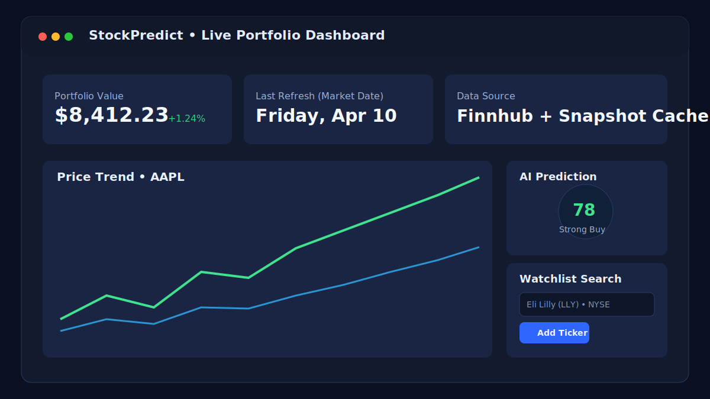
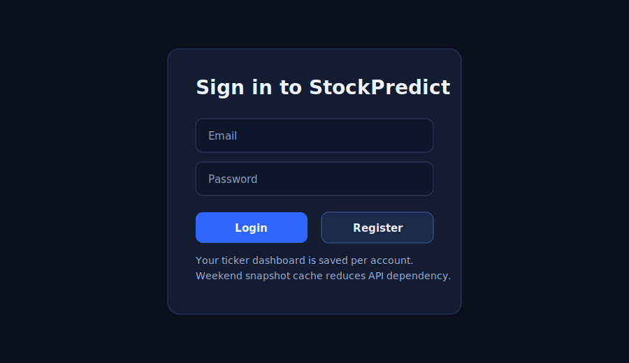
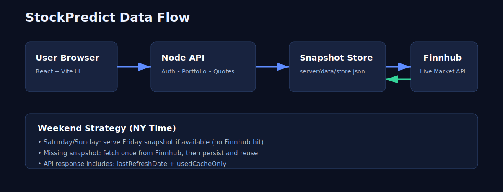

# StockPredict

A modern, full-stack stock intelligence dashboard with:

- 🔐 Account login and user-specific watchlists
- 📈 Live market quotes + news from Finnhub (server-side token)
- 🧠 Prediction scoring + analyst/financial detail panels
- 📊 Real Finnhub candle chart + company profile metadata
- 🗂 Weekend snapshot persistence to reduce market API dependency
- 🚀 Ready for local dev, Docker, and Render deployment



---

## Why StockPredict?

StockPredict is designed to be transparent, fast, and practical:

- **Transparent data sourcing**: users can validate symbols and trends via Finnhub/Yahoo/Google links.
- **Operational reliability**: weekends and rate-limit scenarios use saved snapshots and cache fallback.
- **Personalized experience**: each logged-in user sees their own portfolio and symbols.
- **Production-ready architecture**: one Node service serves both API + front-end bundle.

---

## UI Preview

### Login Experience



### Data Flow + Weekend Strategy



---

## Core Features

### 1) Secure Authentication
- Register/login endpoints (`/api/auth/register`, `/api/auth/login`, `/api/auth/me`)
- Token-based authenticated API access
- Password hashing in backend

### 2) Personal Dashboard Persistence
- User portfolios are stored and restored per account
- Re-login returns the same ticker dashboard
- Portfolio APIs are user-scoped (`/api/portfolio`)

### 3) Live + Cached Market Data
- Stock quote/profile/metric/search/news/detail endpoints under `/api/stocks/*`
- Finnhub requests are cached with TTL to reduce API pressure
- Stale fallback logic handles transient failures/rate limits

### 4) Weekend Snapshot Mode (NY time)
- On Saturday/Sunday, app prefers Friday-end snapshots
- If missing, one-time fetch is stored and reused
- API returns freshness metadata:
  - `lastRefreshDate`
  - `usedCacheOnly`

### 5) Transparency & Trust Signals
- In-app source references
- Easy external verification paths (Finnhub, Yahoo, Google)
- Clear note when cached snapshots are being used

---

## Architecture

### Frontend
- React + Vite + TypeScript
- Component-driven UI with stock detail, charting, and search suggestions

### Backend
- Node HTTP server (`server/index.js`)
- Built-in auth/session handling
- File-backed temporary data store (`server/data/store.json`)
- Finnhub integration with request caching and weekend snapshot logic

### Data Store (free approach)
- Uses local JSON persistence (no paid DB required)
- Suitable for temporary/free usage and quick deployments
- On ephemeral hosts, persistence depends on host disk behavior

---

## API Summary

### Auth
- `POST /api/auth/register`
- `POST /api/auth/login`
- `GET /api/auth/me`

### Portfolio
- `GET /api/portfolio`
- `POST /api/portfolio`

### Stocks
- `GET /api/stocks?symbols=AAPL,MSFT`
- `GET /api/stocks/search?q=eli lilly`
- `GET /api/stocks/:symbol/detail`
- `GET /api/stocks/:symbol/news`

### Health
- `GET /api/health`

---

## Local Development

### 1) Configure environment

```bash
cp .env.example .env
```

Add your key:

```env
FINNHUB_API_KEY=your_finnhub_api_key_here
PORT=8787
```

### 2) Install dependencies

```bash
npm i
```

### 3) Run backend + frontend

```bash
npm run dev:server
```

In another terminal:

```bash
npm run dev
```

- Frontend: `http://localhost:3000`
- Backend: `http://localhost:8787`

> Vite proxies `/api` to the local backend.

---

## Production Run (single service)

```bash
npm i
npm run build
FINNHUB_API_KEY=your_key npm run start
```

---

## Deploy Options

### Render (recommended)

Use the included `render.yaml`:

1. Push repo to GitHub
2. In Render, create a **Blueprint** service from this repo
3. Set `FINNHUB_API_KEY`
4. Deploy

### Docker

```bash
docker build -t stockpredict-live .
docker run -p 8787:8787 -e FINNHUB_API_KEY=your_key stockpredict-live
```

---

## Reliability Notes

- Finnhub free tiers enforce rate limits.
- Backend cache + weekend snapshots significantly reduce call frequency.
- If Finnhub is temporarily unavailable, cached data may still serve key views.

---

## Security Notes

- Finnhub key stays server-side only.
- Browser never receives the API key.
- Auth uses token session validation and hashed passwords.

---

## Project Structure

```txt
server/
  index.js            # Node API, auth, caching, snapshots
  data/store.json     # file-backed temporary persistence
src/
  App.tsx             # main app + auth UX
  services/api.ts     # typed API client
  components/         # dashboard/search/detail UI
docs/images/          # README visuals
```

---

## Attribution

- Market and metadata: [Finnhub](https://finnhub.io/docs/api)
- Validation references: [Yahoo Finance](https://finance.yahoo.com/), [Google Finance](https://www.google.com/finance)

---

## License & Usage

This repository remains proprietary as defined by the project owner. Please review existing repository license notes before reuse or distribution.
